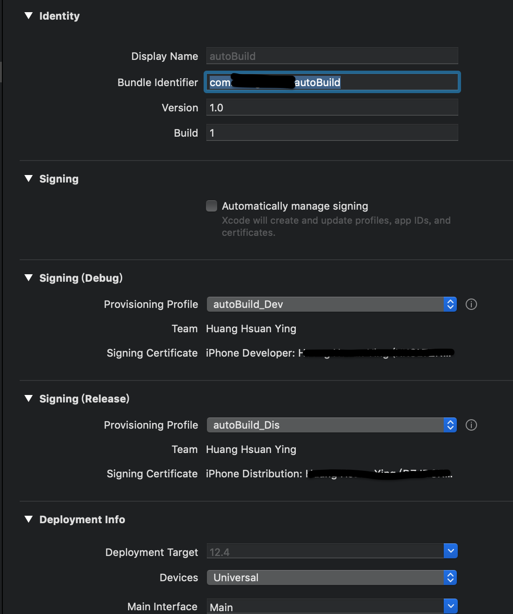
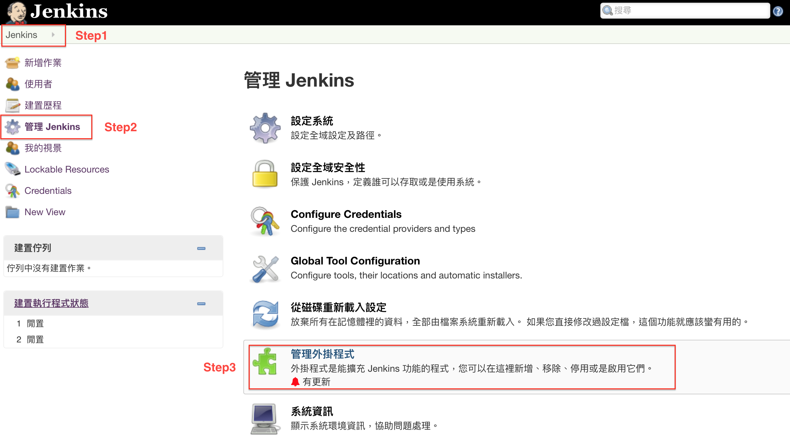
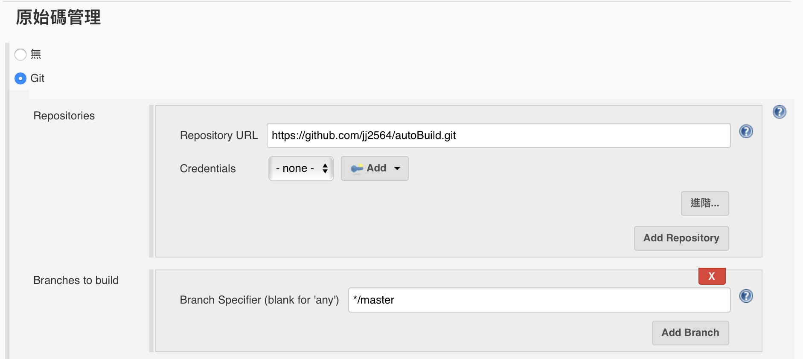
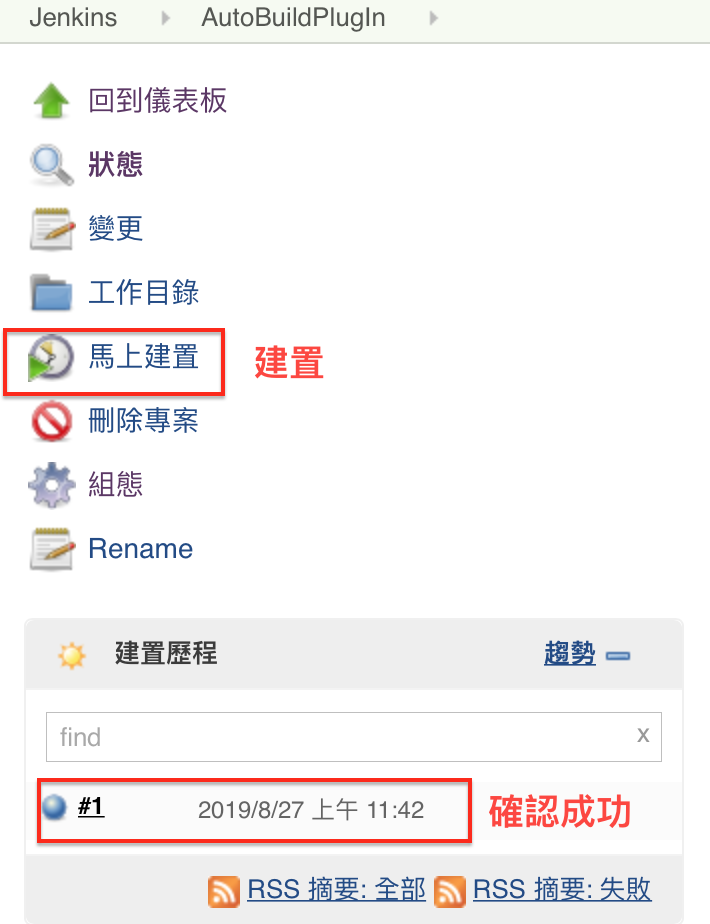
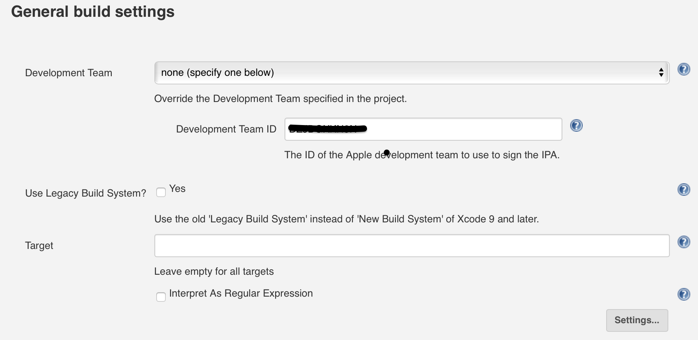
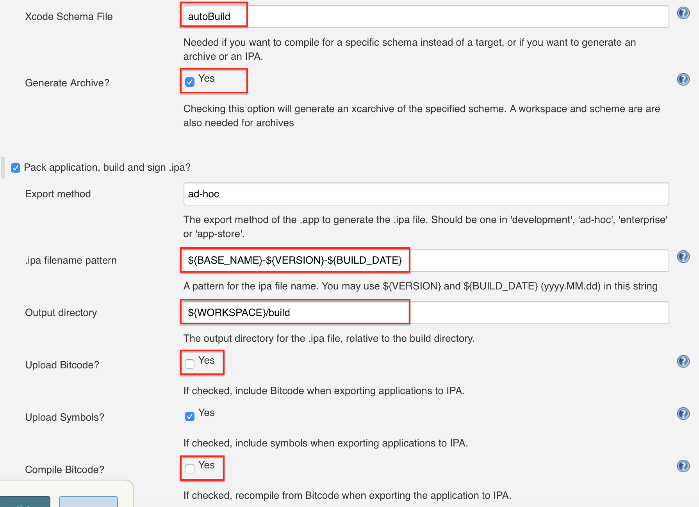
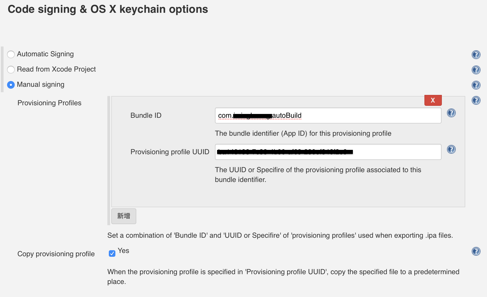
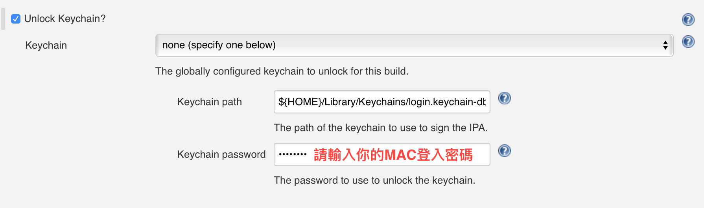
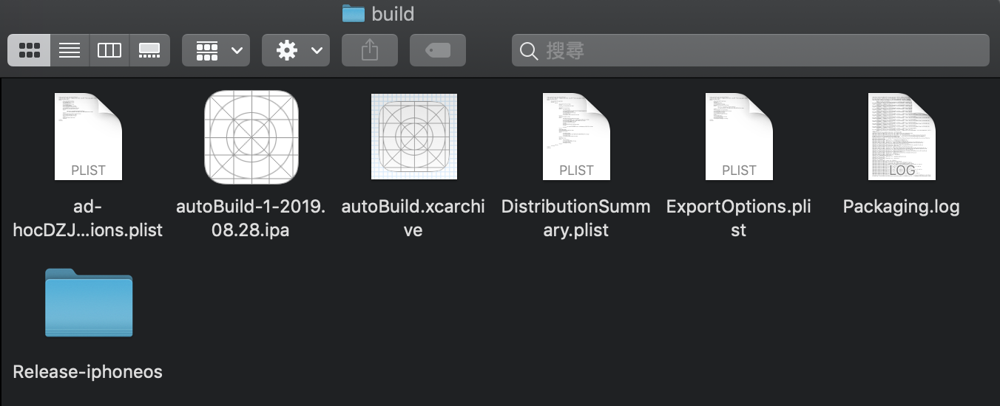

# Jenkins自動編譯Github專案
Use Jenkins for auto export ipa
Jenkins auto build projecet and export .ipa on Github by Xcode plugin and xcodebuild script.

以下為建置步驟，我會針對我覺得比較容易卡關的部分來強調，網路資源偏多的就不太著重了。

另外也可以參考我的另外兩篇筆記 [Use RVM on Xcode project](https://gist.github.com/jj2564/6a5788306537d6eb2bc1f91bcc6cfd8c) & [Jenkins with RVM](https://gist.github.com/jj2564/a52fbe90955b10b13b1fd1a5b68914de)，透過使用RVM來統一開發環境也是CD中的一環。

## 1. Xcode設置
產生一個Xcode專案後將Automaticallty manage signing關閉，並在[Apple Developer](https://developer.apple.com/account/)分別設置好Debug & Release的Provisioning files下載下來些收好之後會使用。  
  

## 2. Jenkins建置
可以到[這裡](https://jenkins.io/download/)來下載安裝檔。
另外Jenkins需要有Java但Mac並沒有內建，可以到[這裡](https://www.oracle.com/technetwork/java/javase/downloads/jdk8-downloads-2133151.html)安裝Java，安裝過程就順勢一路下去就好，就不特別做教學了。  
打開Jenkins後先去安裝PlugIn，如果打不開請確認一下Java有沒有成功安裝。  
> Jenkins -> 管理Jenkins -> 管理外掛程式 -> 可用的   
  

搜尋 **Xcode Integration** 將PlugIn進行安裝，之後重啟Jenkins。  

### 2-1 Proviosiong files
因為jenkins也是user的關西，所以會有自己的鑰匙圈與provisioning files的位置，我們可以直接把兩個資料夾從自己的使用者位置移動到jenkins底下的位置
```path
/Users/{YOUR_USER_NAME}/Library/MobileDevice/Provisioning\ Profiles
/Users/{YOUR_USER_NAME}/Library/Keychains
```
to
```path
/Users/Shared/Jenkins/Library/MobileDevice/Provisioning\ Profiles
/Users/Shared/Jenkins/Library/Keychains
```
到這一步驟就完成了環境的建置了。

### 2-2 Download Code
接下來會用兩種方式來完成可以Export IPA，請先把本地建好的專案上傳到Github上。 
> Jenkins -> 新增作業 -> 建置Free-Style專案  
  

把Git網址填入，然後選擇用master branch當標準，有別的需求的話也可以選別的branch。
然後儲存後進行第一次建置專案，確認成功後，我們可以在以下路徑看到我們的專案已經被導入了
```path
/Users/Shared/Jenkins/Home/workspace
```
  
到這裡基本上不應該有建制失敗的情況，如果有請確認一下是否有什麼事情多做或是少做了。  

### 2-3 Xcode Integration
選擇**組態**回到管理的頁面，然後拉到建置的部分選擇下拉選單到**Xcode**
為了統一編譯環境一樣加入script，若是沒有上傳Pods資料夾在加入第二行script
```script
POD_PATH=/usr/local/bin/pod
${POD_PATH} update --verbose --no-repo-update
```

#### General build settings
   
Setting -> Xcode Schema File -> 填入專案名稱  -> Generate Archive? -> YES


#### Code signing & OS X keychain options  
  

  
Keychain path請輸入
```PATH
${HOME}/Library/Keychains/login.keychain
```
#### Advanced Xcode build options
用Pod或其他Workspace的情況  
***Xcode Workspace File > 輸入專案名稱***  
有多個Project要指定的情況  
***Xcode Project File > 輸入專案名稱***  
指定編譯資料夾
***${WORKSPACE}/build***
這樣會建置在 
```path
/Users/Shared/Jenkins/Home/workspace/{PROJECT_NAME}/build
```

完成以上進行建置後，就會在上述位置看到完全完成的檔案了。
之後可以再使用shell script把檔案搬移到指定位置，會是最初在build folder就指定到想要的位置。



### 2-4 Xcodebuild script
請先確認電腦中有安裝xcodebuild不過通常有安裝Xcode10以上的版本都會內建，所以應該不用擔心。
使用script我個人認為自由度比較高，也比較好理解其中的邏輯。 

#### ExportOption.plist
那麼最大的差異就是我們需要多準備一個檔案，看到之前用Xcode Plugin完成的資料夾中有一個**ExportOption.plist**，這是一個用來進行export放置資訊的檔案，透過xcode來進行時會由xcode自動幫忙準備好，不過用script的時候我們得自己準備好。
基本上這個檔案的內容都大同小異，可以從我這邊[下載](https://github.com/jj2564/CDwithJenkins/blob/master/ExportOptions.plist)，也可以複製以下自己製作，記得要補充上真的對這個專案的資料。
```xml
<?xml version="1.0" encoding="UTF-8"?>
<!DOCTYPE plist PUBLIC "-//Apple//DTD PLIST 1.0//EN" "http://www.apple.com/DTDs/PropertyList-1.0.dtd">
<plist version="1.0">
<dict>
	<key>compileBitcode</key>
	<true/>
	<key>method</key>
	<string>ad-hoc</string>
	<key>provisioningProfiles</key>
	<dict>
		<key>{YOUR_BUNDLE_ID}</key>
		<string>{UUID_OF_PROVISIONING_PROFILES}</string>
	</dict>
	<key>signingCertificate</key>
	<string>iPhone Distribution</string>
	<key>signingStyle</key>
	<string>manual</string>
	<key>stripSwiftSymbols</key>
	<true/>
	<key>teamID</key>
	<string>{YOUR_DISTRIBUTION_TEAM_ID}</string>
	<key>thinning</key>
	<string>&lt;none&gt;</string>
</dict>
</plist>
```

我會將ExportOption.plist一同放入專案中上傳，不過具體怎麼使用還是看個人。

#### Enviroment Variable
```script
# start
APP_NAME="{YOUR_APP_NAME}"
# info.plist路徑
PROJECT_INFOPLIST_PATH="./${APP_NAME}/Info.plist"
# exportOptions.plist路徑
EXPORT_PLIST="./ExportOptions.plist"
# 取得版本號
BUNDLE_SHORT_VERSION=$(/usr/libexec/PlistBuddy -c "Print :CFBundleShortVersionString" "${PROJECT_INFOPLIST_PATH}")
DATE="$(date +%Y-%m-%d" "%H-%M)"
IPA_NAME="${APP_NAME}_V${BUNDLE_SHORT_VERSION}.${BUNDLE_VERSION}_${DATE}.ipa"
# 指定到目前的資料夾
IPA_PATH="$PWD/${IPA_NAME}"
```

#### Clean
```script
xcodebuild \
    -workspace "${APP_NAME}.xcworkspace" \
    -scheme "${APP_NAME}"  \
    -configuration 'Release' \
    clean
```

#### Archive
```script
xcodebuild \
    -workspace "${APP_NAME}.xcworkspace" \
    -scheme "${APP_NAME}" \
    -configuration 'Release' \
    -archivePath "${APP_NAME}.xcarchive" \
    PROVISIONING_PROFILE_SPECIFIER="{UUID_OF_PROVISIONING_PROFILES}" \
    DEVELOPMENT_TEAM="{YOUR_DISTRIBUTION_TEAM_ID}" \
    -allowProvisioningUpdates \
    archive
```

#### Export
```script
xcodebuild \
    -exportArchive \
    -archivePath "${APP_NAME}.xcarchive" \
    -exportOptionsPlist "${EXPORT_PLIST}" \
    -exportPath "$PWD"

mv "${APP_NAME}.ipa" "${IPA_NAME}"
```
把以上部分的資料填齊全即可成功在專案內部成功建出ipa擋了，如果是企業版用戶的話，只要把ad-hoc換成enterprise即可，相關的憑證也進行更換。

### 2-5 建制觸發程序
自動編譯的機制做好了，但是覺得還是哪裡怪怪的，到以上為止雖然說是自動，但是還是要登入Jenkins點下組建然後看者進度條，這根本不是自動！
所以我們在組態中找到這個區塊。

#### SCM & 定期建置 (Crontab)
SCM(Source Control Management)，這是一個可以讓Jenkins定期去檢查我們設定的git source有無更新的機制。  
格式大概是如下所示。
```
* * * * *
```
第一眼看起來完全看不懂這是什麼表示法，不過以上這樣所表示為**每分鐘進行一次**的意思，這是一種Linux中稱作***Crontab***的表示法。  
這五個*分別代表了
- MINUTE 0~59
- HOUR  0-23
- DAY OF MONTH 1-31
- MONTH 1-12
- DAY OF WEEK 

|     名稱      | 範圍  |
| ------------ | :--: |
| MINUTE       | 0-59 |
| HOUR         | 0-23 |
| DAY OF MONTH | 1-31 |
| MONTH        | 1-12 |
| DAY OF WEEK  | 0-7  |

大概舉幾個範例就能明白  

|      Crontab      |                         效果                          |
| ----------------- | :----------------------------------------------------: |
| H/15 * * * * *    | 每15分鐘進行一次(從存檔時開始進算，所以不會是剛好是0, 15, 30) |
| 30 9-18 * * *     |                 每天9-18點鐘30分整的時候                  |
| 45 9-16/2 * * 1-5 |        每兩小時的45分且在9-16點的工作日(週一至週五)         |
| H H 1,15 1-11 *   |           每天一次，在每個月的1日與15日，除了12月           |

定期建置的話格式與剛剛的SCM是一樣的，這是給需要一定時間就發出測試版本使用的，有此需求也可以使用。

#### GitHub hook trigger for GITScm polling
這是一個Github的Plugin所提供的功能，可以再有資料更新的時候發出一個webhook，讓Jenkins根據這個event來進行自動編譯。


